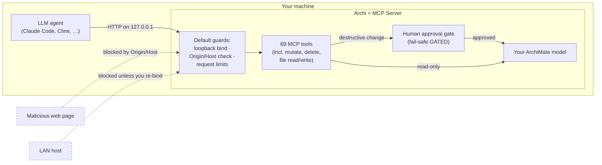

# Security Policy

JGS Archi Bridge embeds an HTTP server inside Archi and exposes your
open model, including **mutating** tools (create, update, delete, undo/redo)
and tools that **read and write files**, to a connected LLM agent. That makes
the trust boundary worth stating plainly.

This document says what the server **protects against by default**, what is
**your responsibility as the operator**, and **how to report a vulnerability**.

---

## The threat model in one sentence

> The threat is not the hostile internet. It is **other local processes on your
> machine, LAN neighbours after one preference change, and a prompt-injected
> agent**, and the mitigations are sized for exactly those.

By default the server binds to loopback (`127.0.0.1`) and validates the
`Origin`/`Host` header, so a remote attacker on the network cannot reach it and
a malicious web page cannot drive it through your browser. The realistic risks
are therefore *local* and *agent-mediated*, and the controls below are built
around that.

---

## What the server protects against **by default**

These hold with **zero configuration**: they are on out of the box.

| Protection | What it does | Threat it closes |
|---|---|---|
| **Loopback-only bind** | Default `Bind Address` is `127.0.0.1`; the port is not reachable from the network. | LAN / remote access. |
| **Origin/Host validation** | Requests whose `Host` (or browser-supplied `Origin`) is not a loopback name are rejected with **HTTP 403**, in front of both `/mcp` and `/sse`. Relaxed automatically only when you deliberately bind off-loopback. | **DNS-rebinding** (a web page in your browser silently driving the tools). |
| **Human-owned approval gate** | Approval mode is owned by the human in Archi, not the agent. A fresh install defaults to **GATED** (fail-safe); the agent has **no tool** to ungate itself or approve its own changes: it can only *observe* that it is gated (`list-pending-approvals`, `approvalMode` on `get-model-info`). Turning the gate *off* requires a desktop confirmation. | An agent (or a prompt-injected agent) silently applying destructive changes. |
| **Agent-scoped undo/redo** | The `undo`/`redo` tools stop at, and refuse to cross, any human edit on the stack, so the agent can never silently revert your hand-drawn work. | Agent clobbering human work via undo. |
| **Request-size cap, idle timeout, bounded thread pool** | Jetty rejects oversized request bodies and idle connections, and runs on a bounded worker pool. | Local request-flood / oversized-payload denial of service. |
| **UTF-8 request-body enforcement** | Requests that declare a non-UTF-8 `charset`, or whose body bytes are not well-formed UTF-8 (even with no declared charset), are rejected with **HTTP 415**. Conformant clients (`charset=utf-8` or none) are unaffected; each check has a kill switch. | Mis-encoded payloads producing silent data corruption or parser confusion. |
| **Session / cache / batch eviction** | Per-session state, caches, and batch contexts are evicted on an idle TTL rather than living forever. | Memory-exhaustion DoS from fabricated or abandoned session IDs. |
| **Bounded remote-image download** | Image fetches from a URL are stream-capped *before* buffering, so an oversized or endless response cannot exhaust memory. | Memory DoS via a hostile image URL. |
| **Secrets in the OS keychain** | The bearer token and the TLS keystore password are stored in Equinox secure storage (macOS Keychain / Windows Credential Store), **never** in cleartext on disk. The server **fails closed** rather than falling back to plaintext or to serving unauthenticated. | Secret-scanner exposure; cleartext secret theft. |
| **Validation parity with Archi** | Model mutations are never stricter nor more forgiving than Archi itself, so MCP-created models stay consistent and cannot be coerced into an invalid state the GUI would reject. | Malformed-model / inconsistency attacks. |

---

## What is **your responsibility** as the operator

These are **not** handled for you. If your deployment needs them, you must turn
them on or put controls around them.

| Your responsibility | Default state | What you should do |
|---|---|---|
| **Transport encryption** | **Plaintext HTTP** on loopback. | Traffic on `127.0.0.1` stays on your machine. If you enable a non-loopback bind, **enable TLS** (Preferences → *Enable TLS* → *Generate Self-Signed Certificate*) so traffic, and any bearer token, is not sent in cleartext. |
| **Client authentication** | **None**: any client that can reach the port can call every tool. | Loopback already restricts *who* can reach the port to processes on your machine. If you want a secret required even on loopback, or you bind off-loopback, **enable the opt-in bearer token** (Preferences → *MCP Server → Authentication*). See the README's *"Enabling authentication"* section. |
| **Other local processes** | Any process on your machine can reach a loopback server. | The bearer token raises the bar to "knows the secret." On a shared or untrusted machine, treat the loopback port as reachable by anything local and gate it with the token. |
| **Binding beyond `127.0.0.1`** | Off by default; a prefs warning appears when you change it. | If you bind to a LAN/`0.0.0.0` address, securing the surface is **on you**: a firewall rule or trusted network, **plus** the bearer token, **plus** TLS. The preferences page warns you when you cross this line. |
| **Prompt injection driving the agent** | The human approval gate is the backstop, not a filter. | A poisoned document can convince an agent to call a destructive or file-touching tool. **Keep approval mode GATED** for any agent acting on untrusted input, and review the plain-language Pending Approvals cards before approving. The gate is your control: use it. |
| **Filesystem paths** *(known limitation)* | `add-image-to-model` reads any readable absolute path; `export-view` writes to any writable directory. There is **no workspace-root allowlist yet**. | Until path-allowlisting ships, assume any file the Archi process can read may be read into the model, and any directory it can write may receive an export. Run with approval mode GATED and review file-touching operations. Tracked for hardening. |

---

## Supported versions

This is a single-maintainer project. Security fixes are made against the
**latest released version** only; please upgrade to the latest release before
reporting. The current release line is published on the
[GitHub Releases](https://github.com/fanievh/archi-mcp-server/releases) page.

| Version | Supported |
|---|---|
| Latest release | ✅ |
| Older releases | ❌ (upgrade to latest) |

---

## Reporting a vulnerability

**Please report security issues privately: do not open a public GitHub issue.**

1. Go to the repository's **Security** tab and choose **"Report a vulnerability"**
   to open a private [GitHub Security Advisory](https://github.com/fanievh/archi-mcp-server/security/advisories/new).
2. Include: affected version, a description of the issue and its impact, and
   reproduction steps (a minimal proof-of-concept helps).

**What to expect:**

- An acknowledgement of your report.
- An assessment, and where the issue is confirmed, a fix in a subsequent release.
- Credit in the release notes for the fix, if you would like it.

Because this is a solo OSS project, please allow reasonable time for a fix
before any public disclosure. Thank you for helping keep users safe.
