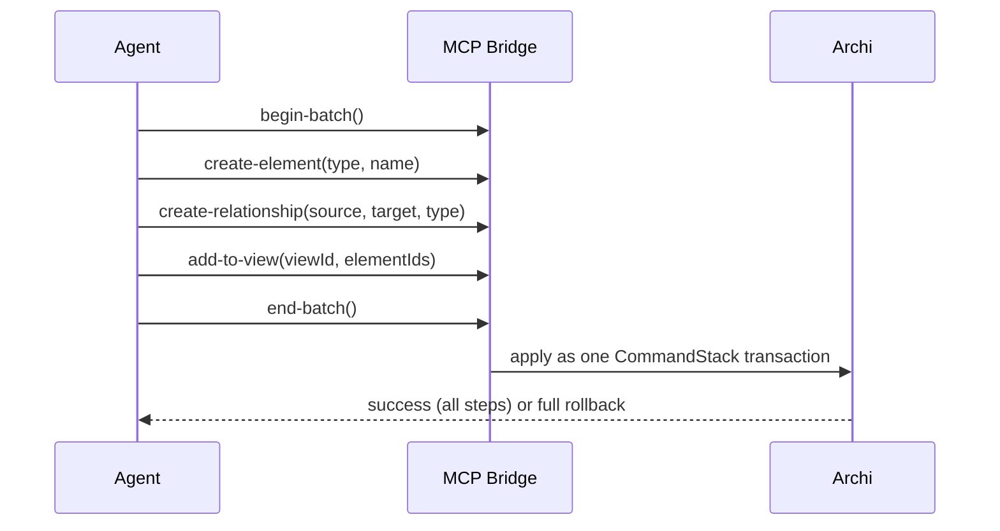

<!-- Copyright (c) 2026 JG Systems Consulting Ltd. See LICENSE. -->

# Using JGS Archi Bridge

## First run

1. Open an ArchiMate model in Archi (or create a new one).
2. **MCP Server > Start MCP Server**. The menu item toggles to **Stop MCP
   Server** while running.
3. With your LLM client connected (see [`install.md`](install.md) and
   [`configuration.md`](configuration.md)), ask a plain-language question:

   > "Give me an overview of this architecture model"

   The client calls `get-model-info` and returns the model's name,
   purpose, and element/relationship/view counts by type and layer. No
   further setup is needed; every other workflow below builds on this.

## Workflow: explore an existing model

**Goal:** understand what a model contains before changing anything.

1. `get-model-info` — name, purpose, counts by type and layer.
2. `search-elements` with a text query (and optional type/layer filters) to
   find relevant elements without knowing exact IDs.
3. `get-relationships` on a found element, with a depth of 1-3 hops, to see
   what it connects to.
4. `find-concept-usage` on an element or relationship before renaming or
   deleting it, to see every view that references it first.

Expected result: element and relationship IDs, names, and cross-view
footprint, all read-only — nothing in the model changes.

## Workflow: create elements and add them to a view

**Goal:** author new model content and place it on a diagram, as one
undoable unit.

1. `search-and-create` (not `create-element` directly) for each new
   element — it searches for an existing match first and only creates on a
   genuine miss, so re-running the same prompt twice doesn't duplicate
   elements.
2. `create-relationship` between the new elements, with ArchiMate
   specification rules enforced (an illegal relationship type for the given
   source/target layer is rejected, not silently created).
3. `add-to-view` to place the new elements and relationships on a diagram.
4. Wrap steps 1-3 in `begin-batch()` / `end-batch()` so they land as a
   single undo step (`Ctrl+Z` in Archi, or the `undo` tool, reverts the
   whole batch at once) instead of one step per call.

Expected result: the elements exist in the model and appear on the named
view in a single atomic change; if approval mode is on, the whole batch
queues as one card in **Pending Approvals** instead of applying immediately.

## Workflow: lay out and route a view

**Goal:** turn a freshly-populated view into a readable diagram.

1. `get-view-contents` on the target view to confirm what's actually placed
   (elements, visual positions, existing routing).
2. An auto-layout tool from the Layout & Routing category (see the
   [README's tool catalogue](../README.md#layout--routing-11-tools)) to
   position elements.
3. `auto-route-connections` to route the relationships between them.
4. `get-view-contents` again to read back the result and confirm the
   layout landed as expected.

Expected result: a laid-out, routed diagram with no manual dragging;
because layout is a mutation like any other, it goes through the same
undo/approval path as element creation.

## Failure and recovery

- **A mutation is rejected with a validation error** — the error's
  `archiMateReference` field cites the relevant ArchiMate specification
  section; fix the request and retry. This is not a bug, it's the server
  enforcing the spec.
- **A prompt seems to have created duplicate elements** — check whether
  `create-element` was used instead of `search-and-create` /
  `get-or-create-element`; the latter two are discovery-first and avoid
  this. Existing duplicates can be found with `search-elements` and merged
  or deleted manually.
- **A batch partially applied** — it shouldn't: `begin-batch()` /
  `end-batch()` is all-or-nothing. If you see partial results outside a
  batch, each unbatched tool call is already its own atomic, undoable
  CommandStack command — undo (`Ctrl+Z` or the `undo` tool) to step back
  one call at a time.
- **Changes aren't appearing in Archi** — check whether **Approval Mode**
  is on (MCP Server menu); if so, the change is queued in **Pending
  Approvals**, not applied, until a human approves it.
- **Something else** — see the [README's Troubleshooting section](../README.md#troubleshooting)
  for server-start, connection, and TLS/secure-storage issues, or report a
  defect per [`SECURITY.md`](../SECURITY.md) / the repository's issue
  templates.
